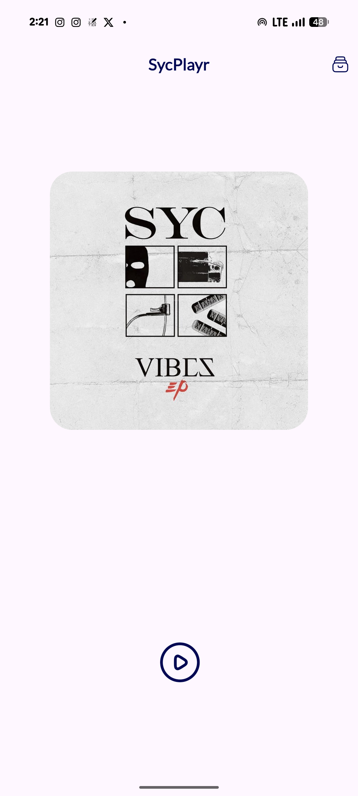
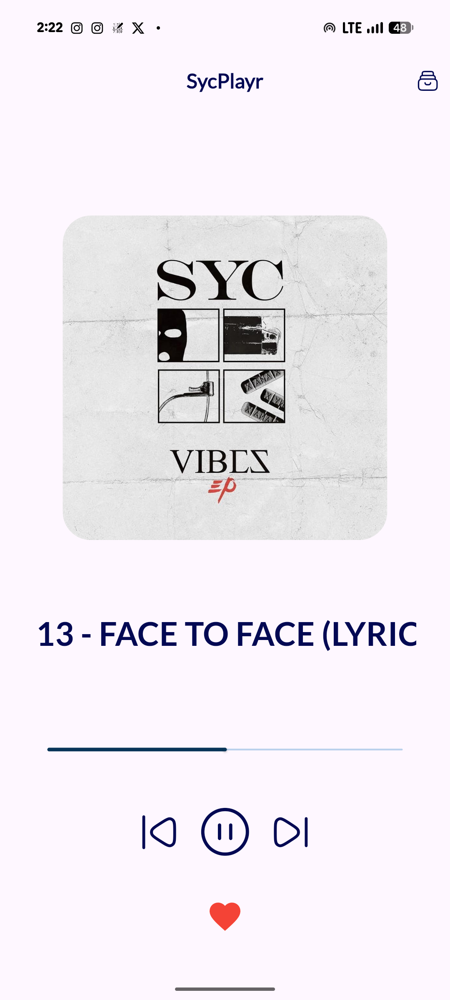
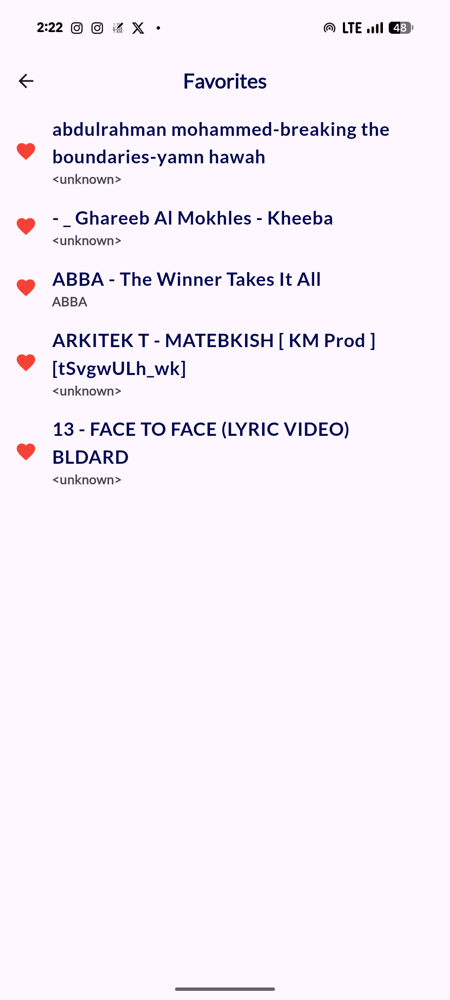

<div align="center">

# 🎵 SycPlayr

### A Native-Bridged Android Music Player — Flutter × Kotlin

*Local music. Zero cloud dependency. Hardware-aware playback.*

[](https://flutter.dev)
[](https://kotlinlang.org)
[](https://developer.android.com)
[](LICENSE)

</div>

---

## Overview

SycPlayr is a fully offline Android music player built with a **Flutter (Dart) UI layer** bridged to a **Kotlin native backend** via a bi-directional `MethodChannel`. It scans the device's local storage for audio files, persists user favorites through an SQLite database, and runs a persistent **Android Foreground Service** for uninterrupted background playback — including gesture-based controls triggered by the device accelerometer.

---

## Technical Stack

| Layer | Technology |
|---|---|
| **UI Framework** | Flutter (Dart SDK ≥ 3.10.8) |
| **Native Backend** | Kotlin (JVM 17) |
| **IPC Bridge** | Android `MethodChannel` — `com.sycplayr.music/command` |
| **Audio Engine** | `android.media.MediaPlayer` (native Android HAL) |
| **Local Persistence** | SQLite via `sqflite` |
| **File Discovery** | `on_audio_query` (MediaStore API) |
| **Background Service** | Android Foreground Service (`FOREGROUND_SERVICE_TYPE_MEDIA_PLAYBACK`) |
| **Notifications** | `NotificationCompat.MediaStyle` with Pending Intents |
| **Build System** | Gradle Kotlin DSL (`build.gradle.kts`), `flutter-gradle-plugin` |
| **Target Platform** | Android API 33+ (Tiramisu), up to API 36 |

---

## Key Features

- **📂 Full Local Library Scan** — Discovers all MP3s on external storage using Android's MediaStore via `on_audio_query`, with metadata parsing offloaded to a Dart `Isolate` (`compute`) to keep the UI thread free.
- **🔊 Background Playback Engine** — A Kotlin `ForegroundService` runs the `MediaPlayer` independently of the app lifecycle, surviving Doze mode with `startForeground()` targeting Android O+.
- **🔔 Lock-Screen Media Notification** — `NotificationCompat.MediaStyle` notification exposes Play / Pause / Next / Previous controls directly from the system tray and lock screen.
- **📳 Shake-to-Toggle** — The device accelerometer (`SensorManager`) is hooked in the Kotlin service. A double-shake gesture (filtered with a 250ms debounce + 1200ms expiration window, using a G-force magnitude threshold) toggles playback without touching the screen.
- **❤️ Persistent Favorites** — A local SQLite database (`db_helper.dart`) persists favorite tracks across sessions. State is propagated reactively via a `ValueNotifier` singleton (`FavoritesManager`).
- **🎨 Animated Playback UI** — A vinyl-style `AnimatedRotation` synced to playback state, `TweenSequence` scale animations on interactions, and `Marquee` auto-scroll for long track names.
- **🔐 Runtime Permission Handling** — Defensive permission requests for `Permission.audio` and `Permission.notification`, conditionally branched for API 13+ (Tiramisu) targeting modern Android security requirements.

---

## Interface & Gallery

<div align="center">
  <table>
    <tr>
      <td align="center">
        <br>
        <i>Branded Splash Screen</i>
      </td>
      <td align="center">
        <br>
        <i>Playback Engine (Idle)</i>
      </td>
    </tr>
    <tr>
      <td align="center">
        <br>
        <i>Active Playback UI with Vinyl Animation Control</i>
      </td>
      <td align="center">
        <br>
        <i>SQLite-Persisted Favorites Library</i>
      </td>
    </tr>
  </table>
</div>

---

## Architecture

```
┌─────────────────────────────────────────────────┐
│                  Flutter (Dart)                 │
│  ┌──────────┐  ┌──────────┐  ┌───────────────┐  │
│  │PlayerPage│  │SycArchive│  │  Favorites UI │  │
│  └────┬─────┘  └────┬─────┘  └──────┬────────┘  │
│       │              │               │            │
│  ┌────▼──────────────▼───────────────▼────────┐  │
│  │         FavoritesManager (ValueNotifier)   │  │
│  │         SQLite (sqflite / db_helper)       │  │
│  │         on_audio_query (MediaStore)        │  │
│  └──────────────────┬─────────────────────────┘  │
│                     │  MethodChannel              │
│              com.sycplayr.music/command           │
└─────────────────────┼───────────────────────────┘
                      │  play / pause / stop / next / previous
                      │  ◄── STATE_CHANGED broadcast ──►
┌─────────────────────┼───────────────────────────┐
│               Kotlin (Android)                  │
│  ┌────────────────────────────────────────────┐ │
│  │              MainActivity.kt               │ │
│  │  BroadcastReceiver ◄── MusicService        │ │
│  └────────────────────────────────────────────┘ │
│  ┌────────────────────────────────────────────┐ │
│  │              MusicService.kt               │ │
│  │  ┌──────────────┐  ┌─────────────────────┐ │ │
│  │  │ MediaPlayer  │  │ SensorEventListener │ │ │
│  │  │ (Playback)   │  │ (Shake Detection)   │ │ │
│  │  └──────────────┘  └─────────────────────┘ │ │
│  │  ┌──────────────────────────────────────┐  │ │
│  │  │  NotificationCompat.MediaStyle       │  │ │
│  │  └──────────────────────────────────────┘  │ │
│  └────────────────────────────────────────────┘ │
└─────────────────────────────────────────────────┘
```

---

## Implementation Details

### Platform Channel Bridge
A **bi-directional `MethodChannel`** (`com.sycplayr.music/command`) connects Flutter and Kotlin. Flutter calls methods (`play`, `pause`, `stop`, `next`, `previous`) which `MainActivity.kt` translates into Android `Intent` commands dispatched to `MusicService`. State changes are broadcast back via `ACTION_BROADCAST` (`com.sycplayr.music.STATE_CHANGED`), received by a `BroadcastReceiver` in `MainActivity`, and forwarded to Flutter to update the UI.

### Isolate-Based Metadata Parsing
Heavy MediaStore query result processing is moved off the main UI thread using Flutter's `compute()` function — spawning a separate `Isolate` for JSON-style map conversions in `songs_data.dart`. This prevents frame drops during library scans on large music collections.

### Foreground Service Lifecycle
`MusicService.kt` calls `startForeground()` with `ServiceInfo.FOREGROUND_SERVICE_TYPE_MEDIA_PLAYBACK`, ensuring Android's battery optimizer cannot terminate playback. The service is started conditionally based on `Build.VERSION_CODES.O` for safe backward compatibility.

### Accelerometer Gesture Engine
Raw 3-axis accelerometer values are converted into a single **G-force magnitude** (`√(x²+y²+z²) / GRAVITY_EARTH`). Two consecutive readings above the threshold within 1200ms — separated by at least 250ms — register as a "double-shake" event and toggle playback. This runs entirely on the native Kotlin layer with no Flutter involvement.

---

## Project Size & Complexity

| Metric | Value |
|---|---|
| Dart source files | 9 |
| Kotlin source files | 2 |
| Total LOC | ~1,600 |
| UI Screens | 5 |
| Platform Channel calls | 6 |
| Native Android services | 1 Foreground Service |
| Hardware sensors used | 1 (Accelerometer) |
| Communication protocols | MethodChannel + BroadcastReceiver |
| Persistence layers | SQLite (favorites) + MediaStore (library) |

---

## Project Structure

```
SycPlayr/
├── lib/
│   ├── main.dart               # App entry, theme, routing
│   ├── player.dart             # Main playback UI & state
│   ├── songs_data.dart         # MediaStore query + Isolate parsing
│   ├── db_helper.dart          # SQLite configuration
│   ├── favorites_manager.dart  # ValueNotifier singleton
│   ├── favorites.dart          # Favorites screen
│   ├── song_detail_view.dart   # Song detail screen
│   ├── syc_archive.dart        # Full library screen
│   └── splash.dart             # Splash / init screen
├── android/
│   └── app/src/main/kotlin/
│       ├── MainActivity.kt     # Channel bridge + BroadcastReceiver
│       └── MusicService.kt     # Foreground Service + MediaPlayer + Sensor
├── pubspec.yaml
└── android/build.gradle.kts
```

---

## Setup (Linux / Arch Linux)

### Prerequisites

```bash
# Install Flutter via AUR
yay -S flutter

# Verify installation
flutter doctor

# Install Android SDK (if not already)
yay -S android-sdk android-sdk-platform-tools
```

### Run

```bash
git clone https://github.com/yourusername/SycPlayr.git
cd SycPlayr

# Get dependencies
flutter pub get

# Connect an Android device or start emulator, then:
flutter run
```

### Build APK

```bash
flutter build apk --release
# Output: build/app/outputs/flutter-apk/app-release.apk
```

---

## Key Dependencies

```yaml
# pubspec.yaml highlights
dependencies:
  on_audio_query: ...       # MediaStore audio discovery
  sqflite: ...              # Local SQLite persistence
  permission_handler: ...   # Runtime permission management
  marquee: ...              # Auto-scrolling text
  google_fonts: ...         # Typography
  hugeicons: ...            # Icon library
```

```kotlin
// build.gradle.kts highlights
implementation("androidx.media:media:1.7.0")  // MediaStyle notifications
```

---

